## Praktikum 1 : HTML Dasar ##

Berikut hasil praktikum saya pada praktikum 1 : HTML dasar

## 1. Membuat dokumen HTML
Untuk membuat dokumen HTML, kita menuliskan dokumen tipe HTML (<!DOCTYPE html>).
Pada bagian title, itu untuk memberi judul pada browsernya.
Berikut lampiran kode dan hasilnya :

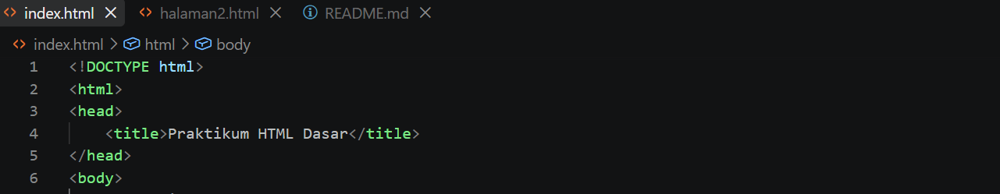
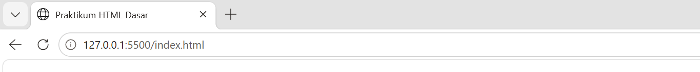

## 2. Membuat paragraf
Untuk membuat paragraf, kita menggunakan tag (

).
Berikut lampiran kode dan hasilnya :

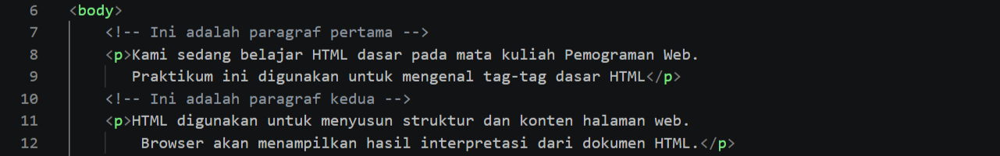
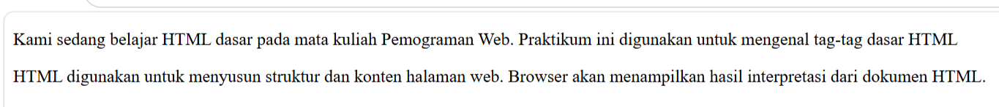

## 3. Membuat judul
Untuk membuat judul, terdapat beberapa tag heading (h1,h2,h3,h4,h5,h6).
Berikut lampiran kode dan hasilnya :

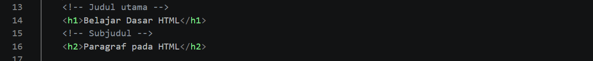

## 4. Memformat teks
Berikut lampiran kode dan hasilnya :

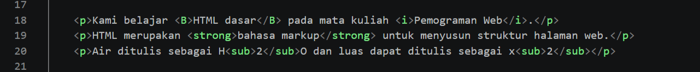
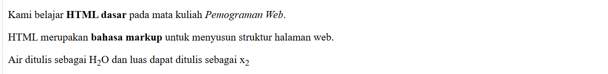

## 5. Menyisipkan gambar dan Menambahkan hyperlink
Untuk menyisipkan gambar, buat folder baru. Lalu menggunakan  untuk menampilkan gambar, bisa mengatur ukuran gambar dengan width. Untuk menambahkan hyperlink, menggunakan <a href="(link)">

Berikut lampiran kode dan hasilnya :

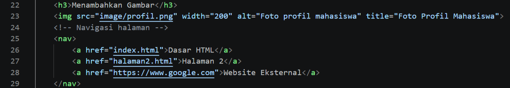

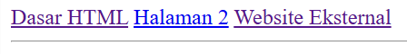

## 6. Menambahkan list
Untuk menambahkan list, ada 3 tag : 1. <ul> untuk daftar tidak berurutan. 2. <ol> untuk daftar berurutan. 3. <li> untuk setiap item di dalam daftar.

Berikut lampiran kode dan hasilnya :

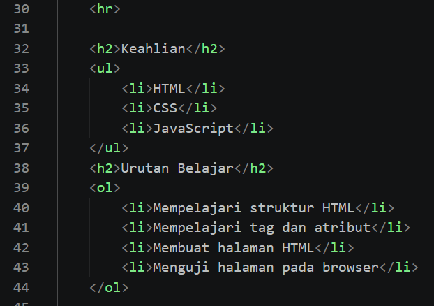
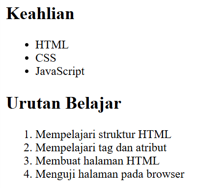

## 7. Menambahkan komentar
Untuk menambahkan komentar, menggunakan <!--komentar-->

Berikut lampiran kode dan hasilnya :

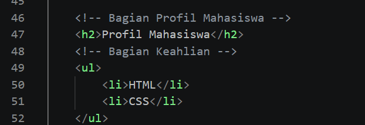

## 8. Menggabungkan semua elemen
Berikut lampiran kode dan hasilnya :

.png)
.png)
.png)
.png)
